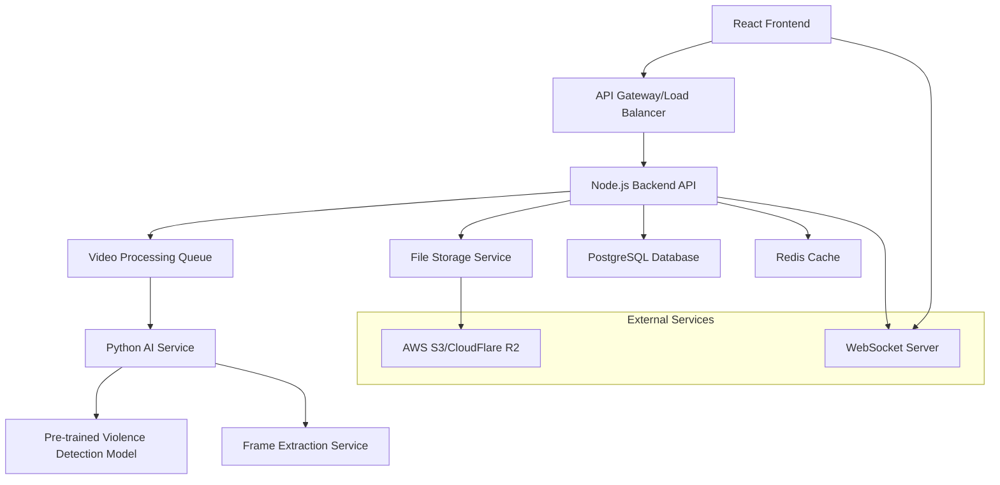

# AI Violence Detection System - Design Document

## Overview

The AI Violence Detection System is a full-stack web application that combines computer vision, machine learning, and modern web technologies to detect violent content in videos. The system uses a microservices architecture with a React frontend, Node.js/Express backend, Python-based AI processing service, and cloud storage for scalability.

## Architecture

### High-Level Architecture



### Technology Stack

**Frontend:**
- React 18 with TypeScript
- Tailwind CSS for responsive design
- React Query for state management
- WebSocket client for real-time updates
- React Dropzone for file uploads

**Backend API:**
- Node.js with Express.js
- TypeScript for type safety
- Multer for file upload handling
- Bull Queue for job processing
- Socket.io for WebSocket connections

**AI Processing:**
- Python 3.9+ with FastAPI
- OpenCV for video processing
- TensorFlow/PyTorch for model inference
- Pre-trained violence detection model (I3D or 3D CNN)
- Celery for distributed task processing

**Database & Storage:**
- PostgreSQL for structured data
- Redis for caching and session management
- AWS S3 or CloudFlare R2 for video storage

**Infrastructure:**
- Docker containers for all services
- NGINX as reverse proxy
- PM2 for Node.js process management

## Components and Interfaces

### Frontend Components

#### 1. Video Upload Component
```typescript
interface VideoUploadProps {
  onUploadComplete: (videoId: string) => void;
  onUploadProgress: (progress: number) => void;
  maxFileSize: number;
  acceptedFormats: string[];
}
```

#### 2. Analysis Dashboard Component
```typescript
interface AnalysisDashboard {
  videoId: string;
  analysisStatus: 'pending' | 'processing' | 'completed' | 'failed';
  progress: number;
  detectedViolence: ViolenceDetection[];
  onStopAnalysis: () => void;
}
```

#### 3. Results Viewer Component
```typescript
interface ResultsViewer {
  analysisReport: AnalysisReport;
  videoUrl: string;
  onExportReport: () => void;
}
```

### Backend API Endpoints

#### Video Management
- `POST /api/videos/upload` - Upload video file
- `GET /api/videos/:id` - Get video metadata
- `DELETE /api/videos/:id` - Delete video
- `GET /api/videos/:id/stream` - Stream video content

#### Analysis Operations
- `POST /api/analysis/start/:videoId` - Start violence detection analysis
- `GET /api/analysis/:analysisId` - Get analysis status and results
- `POST /api/analysis/:analysisId/stop` - Stop ongoing analysis
- `GET /api/analysis/history` - Get user's analysis history

#### Real-time Updates
- WebSocket endpoint: `/ws/analysis/:analysisId`
- Events: `progress_update`, `violence_detected`, `analysis_complete`

### AI Service Interface

#### Violence Detection API
```python
class ViolenceDetectionService:
    def analyze_video(self, video_path: str) -> AnalysisJob:
        """Start asynchronous video analysis"""
        
    def get_analysis_status(self, job_id: str) -> AnalysisStatus:
        """Get current analysis progress"""
        
    def extract_frames(self, video_path: str, interval: int = 1) -> List[Frame]:
        """Extract frames at specified intervals"""
        
    def detect_violence_in_frame(self, frame: np.ndarray) -> ViolenceScore:
        """Analyze single frame for violence"""
```

## Data Models

### Database Schema

#### Videos Table
```sql
CREATE TABLE videos (
    id UUID PRIMARY KEY DEFAULT gen_random_uuid(),
    filename VARCHAR(255) NOT NULL,
    original_name VARCHAR(255) NOT NULL,
    file_size BIGINT NOT NULL,
    duration INTEGER, -- in seconds
    format VARCHAR(10) NOT NULL,
    storage_path TEXT NOT NULL,
    uploaded_at TIMESTAMP DEFAULT NOW(),
    user_id UUID REFERENCES users(id)
);
```

#### Analysis Table
```sql
CREATE TABLE analyses (
    id UUID PRIMARY KEY DEFAULT gen_random_uuid(),
    video_id UUID REFERENCES videos(id) ON DELETE CASCADE,
    status VARCHAR(20) NOT NULL DEFAULT 'pending',
    progress INTEGER DEFAULT 0,
    started_at TIMESTAMP DEFAULT NOW(),
    completed_at TIMESTAMP,
    total_frames INTEGER,
    violent_frames INTEGER DEFAULT 0,
    confidence_threshold DECIMAL(3,2) DEFAULT 0.70
);
```

#### Violence Detections Table
```sql
CREATE TABLE violence_detections (
    id UUID PRIMARY KEY DEFAULT gen_random_uuid(),
    analysis_id UUID REFERENCES analyses(id) ON DELETE CASCADE,
    timestamp_seconds DECIMAL(10,3) NOT NULL,
    confidence_score DECIMAL(5,4) NOT NULL,
    frame_number INTEGER NOT NULL,
    bounding_boxes JSONB, -- for object detection if needed
    created_at TIMESTAMP DEFAULT NOW()
);
```

### TypeScript Interfaces

```typescript
interface ViolenceDetection {
  id: string;
  timestampSeconds: number;
  confidenceScore: number;
  frameNumber: number;
  boundingBoxes?: BoundingBox[];
}

interface AnalysisReport {
  id: string;
  videoId: string;
  status: AnalysisStatus;
  progress: number;
  totalFrames: number;
  violentFrames: number;
  detections: ViolenceDetection[];
  startedAt: Date;
  completedAt?: Date;
  summary: {
    totalViolentScenes: number;
    averageConfidence: number;
    mostViolentTimestamp: number;
  };
}
```

## Error Handling

### Frontend Error Handling
- Global error boundary for React components
- Toast notifications for user-facing errors
- Retry mechanisms for failed API calls
- Graceful degradation for WebSocket connection failures

### Backend Error Handling
- Centralized error middleware for Express.js
- Structured error responses with error codes
- Request validation using Joi or Zod
- Rate limiting to prevent abuse

### AI Service Error Handling
- Model loading failure recovery
- Video processing error handling
- Memory management for large video files
- Timeout handling for long-running analyses

### Error Response Format
```typescript
interface ErrorResponse {
  error: {
    code: string;
    message: string;
    details?: any;
    timestamp: string;
  };
}
```

## Testing Strategy

### Frontend Testing
- Unit tests for React components using Jest and React Testing Library
- Integration tests for API interactions
- E2E tests using Playwright for critical user flows
- Visual regression tests for UI components

### Backend Testing
- Unit tests for API endpoints and business logic
- Integration tests for database operations
- Load testing for concurrent video processing
- API contract testing

### AI Service Testing
- Model accuracy testing with labeled violence detection datasets
- Performance benchmarking for different video formats
- Memory usage testing for large video files
- Frame extraction accuracy validation

### Test Data Management
- Synthetic test videos for different violence scenarios
- Mock AI model responses for consistent testing
- Database seeding for integration tests
- Automated test data cleanup

## Security Considerations

### File Upload Security
- File type validation and sanitization
- Virus scanning for uploaded videos
- Size limits and rate limiting
- Secure file storage with access controls

### API Security
- JWT-based authentication
- Role-based access control
- Input validation and sanitization
- CORS configuration for frontend access

### Data Privacy
- Automatic video deletion after analysis completion
- Encrypted storage for sensitive data
- Audit logging for all operations
- GDPR compliance for user data

## Performance Optimization

### Video Processing
- Parallel frame extraction and analysis
- GPU acceleration for AI model inference
- Video compression before analysis
- Caching of analysis results

### Frontend Performance
- Lazy loading of components
- Video streaming with adaptive bitrate
- Progressive loading of analysis results
- Service worker for offline capabilities

### Database Optimization
- Indexing on frequently queried columns
- Connection pooling for concurrent requests
- Query optimization for large datasets
- Archival strategy for old analysis data